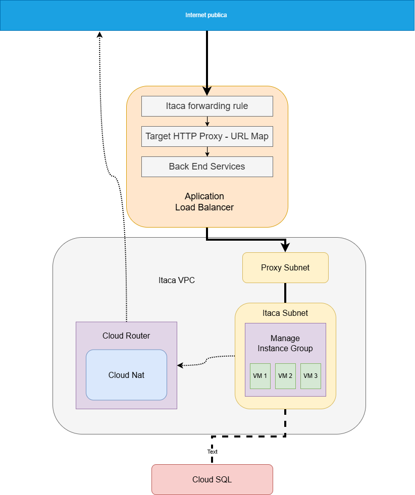

# Arquitectura Elastica y Alta Disponibilidad en GCP con Terraform
## Fase 1 computo y redes
Este repositorio contiene los codigos en terraform para desplegar una arquitectura elastica en Google CLoud Computing (GCP) el diseño esta enfocado en aislar la capa de computo del acceso publico y garantizar el escalado automatico ante picos de demanda.

## objetivos
El objetivo es crear una arquitectura elastica, escalable y funcional

## componentes base de la arquitectura  
- **elasticidad avanzada** implementacion de un Managed Instance Group MIG. con politicas de auto escalado basada en uso de CPU y auto-healing verificados mediante health checks dedicados.<br>
- **distribucion de trafico** configuracion de un aplication load balancer para el balanceo de carga de solicitudes de red.<br>
- **seguridad perimetral** diseño back end 100% aislado en una VPC custom. las instancias carecen de ip publica, con cloud nat para la descarga de actualizaciones de forma segura.<br>

### notas de diseño 
- Arquitectura Stateless (Fase 1): Esta primera versión fue diseñada de forma intencional sin capa de persistencia (Base de Datos) para enfocarnos única y puramente en validar el comportamiento del cómputo elástico y la distribución de red. La capa de datos se abordará en la Fase 2.
- Recursos Planos vs. Módulos (Claridad Didáctica): Se optó por utilizar resources individuales de Terraform en lugar de módulos prefabricados. Esto garantiza un control granular sobre cada parámetro y aporta claridad didáctica, ya que cada bloque de código refleja de forma explícita un componente de la topología real.
- Seguridad Zero-Trust y Acceso vía IAP: Las instancias carecen de IP pública y el puerto 22 (SSH) no está abierto a todo internet. La regla de firewall allow-ssh-itaca solo permite tráfico desde la red 35.235.240.0/20 (rango oficial de Identity-Aware Proxy de Google), mediando el acceso seguro sin necesidad de Bastion Hosts.
- Topología de Red Aislada (Custom VPC): Se desactivó la creación automática de subredes (auto_create_subnetworks = false) para evitar solapamientos de IP. La salida a internet de las VMs para descargar paquetes de sistema se resolvió usando Cloud NAT y Cloud Router, manteniendo el clúster 100% aislado.
- Alta Disponibilidad Multi-Zona (Regional MIG): El Managed Instance Group no es zonal, es Regional. Al distribuir las políticas en múltiples zonas (southamerica-west1-a y b), se garantiza que si un centro de datos entero de Google experimenta una interrupción, la arquitectura siga operando.
- Balanceo de Carga de Nueva Generación y Subred Proxy: Para implementar el Load Balancer HTTP regional (EXTERNAL_MANAGED), Google Cloud exige una subred dedicada. Se creó itaca_proxy con el propósito REGIONAL_MANAGED_PROXY, aislando el tráfico de los proxies (Envoy) del tráfico interno de las VMs.
- Infraestructura Inmutable (Startup Scripts): Se utilizó el patrón de Startup Script inyectado en la Metadata. Las instancias nacen limpias (imagen base de Debian 11) y se autoconfiguran al bootear instalando FastAPI y Uvicorn, facilitando la rotación de nodos ante futuras actualizaciones de la API.
- Estabilidad de Métricas y Prevención de Flapping: Al usar máquinas pequeñas (e2-micro), el simple hecho de instalar dependencias eleva la CPU al 100%. Para evitar que el autoscaler lea esto como un "falso positivo" y cree réplicas innecesarias (flapping), se separó la fase de aprovisionamiento de la de carga real sincronizando tiempos lógicos: un initial_delay_sec de 300s en el MIG, un cooldown_period de 180s en el Autoscaler, y un sleep de 300s en el script de estrés.

## Diagrama de arquitectura visual
<figure>
  
  <figcaption><em>Arquitectura stateless — Fase 1. El componente Cloud SQL representa la capa de persistencia planificada para la Fase 2.</em></figcaption>
</figure>

### requisitos
- **cuenta de Google Cloud Computing GCP** - un proyecto de GCP creado y activo, cuenta de facturacion (BIlling) vinculada al proyecto.
- **APIs Habilitadas** - la api de compute engine habilitada en el proyecto.
- **Herramientas de linea de comandos (CLI) y terraform** - terraform instalado en tu entorno local, Gcloud instalado y autenticado.
- **Permisos de IAM** - tener los permisos en GCP para crear redes y maquinas virtuales.

### despliegue
1. Clonar el repositorio: git clone [https://github.com/tu-usuario/tu-repo.git](https://github.com/Anon277ARG/Arquitectura-Elastica-y-Alta-Disponibilidad-en-GCP-con-Terraform.)
2. autenticar en gcp: gcloud auth application-default login
3. Configurar el proyecto: gcloud config set project cloud-lab-493
4. iniciar terraform: terraform init
5. verificar los cambios antes de aplicar: terraform plan
6. PASO OPCIONAL, este paso solo es importante si estamos en un entorno Windows, en caso contrario se puede saltear ```(Get-Content main.tf -Raw) -replace "`r`n", "`n" | Set-Content main.tf -NoNewline ``` para asegurarnos que no hayan incompatibilidades entre el entorno windows y el linux de gcp
7. aplicar la infraestructura: terraform apply
8. Una vez obtenida la IP, abrí `http://<ip>` en el navegador. Durante los primeros 5 minutos la arquitectura no va a responder, 
ese comportamiento está documentado en la sección de operaciones.
9. Destruir el entorno cuando termine: terraform destroy
   
## Componentes

### redes
- red VPC privada con el nombre de "itaca-network" creada en Santiago, la unica configuracion relevante aca es que se desactivo la creacion automatica de subredes.
  ```
  resource "google_compute_network" "itaca_network" {
    name = "itaca-network"
    routing_mode = "GLOBAL"
    auto_create_subnetworks = false
  }
  ```
- sub red con el nombre de "Itaca-subnet" dedicada a asegurar la privacidad de las VMs.
  ```
  resource "google_compute_subnetwork" "itaca_subnet" {
    name = "itaca-subnetwork"
    region = var.region
    ip_cidr_range = "10.42.0.0/24"
    network = google_compute_network.itaca_network.id
    private_ip_google_access = true
  }
  ```
- sub red proxy para asegurar la conexion entre el Load Balancer y la sub red de las VMs.
  ```
  resource "google_compute_subnetwork" "itaca_proxy" {
    name = "itaca-subnetwork-proxy"
    region = var.region
    ip_cidr_range = "10.129.0.0/23"
    network = google_compute_network.itaca_network.id
    purpose = "REGIONAL_MANAGED_PROXY"
    role = "ACTIVE"
  }
  ```
- cloud router para el ruteo a la internet publica
  ```
  resource "google_compute_router" "itaca_router" {
    name = "itaca-router"
    region = var.region
    network = google_compute_network.itaca_network.id

  }
  ```
- cloud nat para la traduccion de ips
  ```
  resource "google_compute_router_nat" "itaca_nat" {
  name = "intaca-mig-updatenat"
  router = google_compute_router.itaca_router.name
  region = var.region
  nat_ip_allocate_option = "AUTO_ONLY"
  source_subnetwork_ip_ranges_to_nat = "ALL_SUBNETWORKS_ALL_IP_RANGES"

    log_config {
    enable = true
    filter = "ALL"
    } 
  }
  ```

### Firewall
- reglas de firewall con el nombre "itaca-firewall, itaca-health-check, allow-ssh-itaca" 
- todas las reglas con el mismo tag para evitar confuciones "itaca-firewalls"
#### abieros los puertos y las ips
- "22 y 35.235.240.0/20" para la conexions ssh
- "8080 y 10.129.0.0/23" para la conexion del proxy con el load balancer
- "8080 y 35.191.0.0/16, 130.211.0.0/22" para los health check
#### codigo de itaca-firewall
```
  resource "google_compute_firewall" "itaca_firewall" {
  name    = "itaca-firewall"
  network = google_compute_network.itaca_network.name

  allow {
    protocol = "tcp"
    ports    = ["8080"]
  }

  source_ranges = ["10.129.0.0/23"]

  target_tags = ["itaca-firewalls"]
  }
```
#### codigo de itaca-health-check
```
resource "google_compute_firewall" "itaca_health_check" {
  name    = "itaca-health-check"
  network = google_compute_network.itaca_network.name

  allow {
    protocol = "tcp"
    ports    = ["8080"]
  }

  source_ranges = ["35.191.0.0/16", "130.211.0.0/22"]

  target_tags = ["itaca-firewalls"]
}
```
#### codigo de allow-ssh-itaca
```
resource "google_compute_firewall" "allow_ssh_itaca" {
  name        = "allow-ssh-itaca"
  network     = google_compute_network.itaca_network.name

  allow {
    protocol = "tcp"
    ports    = ["22"]
  }

  source_ranges = ["35.235.240.0/20"]

  target_tags = ["itaca-firewalls"]
}
```
### BackEnds
#### MAnage Intance Group con la siguiente configuracion
- con el nombre "itaca-mig
- conectado al puerto 8080
- configurado en la region santiago
- initial delay de 300 segundos de delay como health check policy, para que las VMs se pongan en linea.
- politicas de distribucion en las zonas a y b de la respectiva region.
##### codigo del Manage Instance Group
```
resource "google_compute_region_instance_group_manager" "mig" { 
   name = "itaca-mig"
   base_instance_name = "itaca-vm-"
   region = var.region
   version {
     instance_template = google_compute_instance_template.mig_template.id
   }
   named_port {
      name = "http"
      port = 8080
    }
   distribution_policy_zones = [
     "${var.region}-a",
     "${var.region}-b",
     ]
   auto_healing_policies {
     health_check = google_compute_region_health_check.itaca_check.id
     initial_delay_sec = 300
   }
  }
```
#### mig template con la siguiente configuracion
- nombre: virtual-machine-template
- tag: "itaca-firewalls" para llamar a todos los firewalls
- instancia: e2-Micro, no es necesario mas.
- bloqueo de enrutamiento no autorizado para que las instancias actuen como nodos finales.
- con la imagen de Debian 11
- con la interfaz de red de itaca Network viviendo dentro de Itaca Subnet.
**configuracion del template**
```
resource "google_compute_instance_template" "mig_template" {
  name        = "virtual-machine-template"
  description = "tose are thet templates used by the manage instance group."

  tags = ["itaca-firewalls"]

  labels = {
    environment = "virtual_machine"
  }

  instance_description = "description assigned to instances"
  machine_type         = "e2-micro"
  can_ip_forward       = false

  scheduling {
    automatic_restart   = true
    on_host_maintenance = "MIGRATE"
  }
  disk {
    source_image      = "debian-cloud/debian-11"
    auto_delete       = true
    boot              = true
  }
  network_interface {
    network = google_compute_network.itaca_network.id
    subnetwork = google_compute_subnetwork.itaca_subnet.id
  }
```
- en la parte de meta data como Startup script que despliega la API para responder inmediatamente a los health checks, y lanza un proceso en segundo plano que, tras 300 segundos de delay, estresa la CPU al 100% para detonar el autoscaling, esto se definio asi ya que la instancia es una e2-Micro y al instalar las dependencias sube el uso de la CPU al 100% activando el autoscaler.
**script de inicio**
```
  metadata = {
    "serial-port-enable" = "true"
    "startup-script"     = <<-EOF
      #!/bin/bash
      apt-get update -y
      apt-get install -y python3 python3-pip stress
      pip3 install fastapi uvicorn

      cat > /home/main.py << 'PYEOF'
from fastapi import FastAPI
import socket

app = FastAPI()

@app.get("/health")
def health():
    return {"status": "ok"}

@app.get("/")
def home():
    return {
        "mensaje": "Instancia activa recibiendo trafico",
        "maquina": socket.gethostname()
    }
PYEOF
      cat > /home/estresar.sh << 'BASH_EOF'
#!/bin/bash
sleep 300
stress --cpu $(nproc) --timeout 960
BASH_EOF
      chmod +x /home/estresar.sh
      python3 -m uvicorn main:app --host 0.0.0.0 --port 8080 --app-dir /home &
      nohup /home/estresar.sh > /home/estresar.log 2>&1 &
    EOF
  }
}
```
#### autoscaler con la siguiente configuracion
- nombre: "autoscaler-itaca"
- politica de autoscaling como 1 en replicas minimas y 6 en replicas maximas
- un cooldown period de 180 segundos para asegurarnos la no creacion de replicas indeseadas.
- como politica de replicacion se configuro uso de CPU al 80%.
```
resource "google_compute_region_autoscaler" "itaca_autoscaler" {
 name = "autoscaler-itaca"
 region = var.region
 target = google_compute_region_instance_group_manager.mig.id
 autoscaling_policy {
   min_replicas = 1
   max_replicas = 6
   cooldown_period = 180
   cpu_utilization {
     target = 0.8
   }
 }
}
```
#### servicio Back end con la siguiente configuracion
- nombre: "itaca-backend-service"
- protocolo: HTTP
- esquema de balanceo de carga como "External Managed" usando el nuevo esquema y dandole sentido a la subnet proxy
- modo de Balanceo configurado en "Utilization" en base al uso
- capacidad de scaler en 1.0
```
resource "google_compute_region_backend_service" "itaca_backend" {
  name = "itaca-backend-service"
  region = var.region
  protocol = "HTTP"
  load_balancing_scheme = "EXTERNAL_MANAGED"
  health_checks = [google_compute_region_health_check.itaca_check.id]
  backend {
    group = google_compute_region_instance_group_manager.mig.instance_group
    balancing_mode = "UTILIZATION"
    capacity_scaler = 1.0
  }
}
```
### Load Balancer
#### Forwarding rule como puerta de acceso a la internet publica
```
resource "google_compute_forwarding_rule" "itaca-forwarding-rule" { 
  name = "itaca-forwarding-rule"
  region = var.region 
  target = google_compute_region_target_http_proxy.itaca_target_proxy.id
  port_range = "80"
  load_balancing_scheme = "EXTERNAL_MANAGED"
  network = google_compute_network.itaca_network.id
  depends_on = [google_compute_subnetwork.itaca_proxy]
}
```
#### Target proxy como intermediario y procesador del tráfico
```
resource "google_compute_region_target_http_proxy" "itaca_target_proxy" { 
  name = "itaca-target-proxy"
  region = var.region
  url_map = google_compute_region_url_map.itaca_url_map.id
}
```
#### URL Map como como enrutador principal
```
resource "google_compute_region_url_map" "itaca_url_map" {
  name = "itaca-url-map"
  region = var.region
  default_service = google_compute_region_backend_service.itaca_backend.id
} 
```
#### Output con la ip publica del balanceador
```
output "ip_publica_balanceador" {
  value = google_compute_forwarding_rule.itaca-forwarding-rule.ip_address
}

```
## operaciones
### siguiendo las instrucciones descritas mas arriba vamos a desplegar esta arquitectura
Despues de clonar este repositorio, autenticarnos en los servicios de google, iniciar terraform y solucionar incompatibilidades entre sistemas operativos, los pasos que se establecen son los siguientes
- ```.\terraform.exe plan``` y ``` .\terraform.exe apply``` al usar estos comandos terraform le pregunta al proveedor si dichos recursos ya existen, trae el estado te la arquitectura actual y actualiza nuestro archivo ```terraform.tfstate``` documento que sirve como respaldo tambien crea un grafo de dependencias, terraform no puede crear una subred si primero no tiene una red.
  <br>
  <br>
<figure>
  
  <figcaption><em>Ejecución del comando terraform plan en la terminal para previsualizar los cambios de infraestructura.</em></figcaption>
</figure>
<br>
<br>
<figure>
  
  <figcaption><em>Resultado de la ejecución de terraform plan indicando un total de 16 recursos cloud listos para ser añadidos a la infraestructura de GCP.</em></figcaption>
</figure>
<br>
<br>
<figure>
  
  <figcaption><em>Ejecución del comando terraform apply iniciando la creación ordenada y en paralelo de los recursos declarados en GCP.</em></figcaption>
</figure>
<br>
<br>
<figure>
  
  <figcaption><em>Confirmación manual (yes) durante el comando terraform apply para autorizar la creación real de 16 recursos en Google Cloud.</em></figcaption>
</figure>
<br>
<br>
<figure>
  
  <figcaption><em>Finalización exitosa del despliegue: Salida de la terminal confirmando los 16 recursos cloud añadidos correctamente en GCP. y mostrando la direccion ip del balanceador de cargas</em></figcaption>
</figure>
<br>

### Fase de Inicializacion y tiempos de gracias
<br>

En este primer paso, si tomamos la dirección IP del balanceador y la abrimos en el navegador, veremos que la arquitectura temporalmente no responde. Esto es un comportamiento esperado, ya que la infraestructura se encuentra intencionalmente "congelada" por diseño para proteger el ciclo de vida de los recursos.
<br>

#### Esta decisión arquitectónica se apoya en tres configuraciones críticas:
1. Initial Delay del Managed Instance Group (300s): Las instancias e2-micro tardan entre 2 y 3 minutos en descargar actualizaciones e instalar dependencias (Python, FastAPI). El Health Check hace pruebas cada 10 segundos y, si falla 3 veces, elimina la instancia. Para evitar incurrir en un loop infinito de creación y destrucción prematura, se configuró un delay de 300 segundos, dándole tiempo de gracia a la máquina para exponer el puerto 8080.
2. Cooldown del Autoscaler (180s): Al instalar las dependencias, el uso de la CPU en una máquina tan pequeña sube naturalmente al 100%. Este cooldown evita que el autoscaler lea ese pico temporal como tráfico real y cree réplicas innecesarias (falsos positivos).
3. Sleep en el Script de Estrés (300s): El monitor de métricas de GCP no diferencia entre "uso de CPU por instalación" y "uso de CPU por estrés". Por lo tanto, el script de arranque tiene un comando sleep 300 antes de ejecutar estresar.sh. Esto nos permite separar las métricas, esperar a que la instancia converja, y recién ahí disparar la CPU al 100% para observar cómo se activa el autoscaler de forma controlada.
<br>
<br>
<figure>
  
  <figcaption><em>como mencione mas arriba al pegar y abrir la direccion ip que copiamos en la terminal, esta no responde.</em></figcaption>
</figure>
<br>
<br>
<figure>
  
  <figcaption><em>si miramos desde compute engine vamos a ver una unica instancia online, ignorar las otras dos intancias</em></figcaption>
</figure>
<br>
<br>
<figure>
  
  <figcaption><em>si miramos desde health check esta instancia esta en mal estado, comportamiento esperado</em></figcaption>
</figure>
<br>
<br>
<figure>
  
  <figcaption><em>si miramos desde autoscaler podemos ver como todavia esta esperando</em></figcaption>
</figure>
<br>

### comportamiento esperado
hasta ahora el comportamiento es el esperado y solo tenemos que esperar hasta que se terminen todos los tiempos 
1. 180 segundos de cooldown para que el autoscaler funcione
2. 300 segundos para que el health check empiece a chequear si la virtual machine responde
3. 300 segundos de sleep para que la instancia comience a estresarse

### pasalos 180 segundos de cooldown del autoscaler podemos ver como esta instancia ya responde
<br>
<figure>
  
  <figcaption><em>si miramos desde autoscaler podemos ver como todavia ya responde</em></figcaption>
</figure>
<br>

### pasados los 300 segundos del health check podemos ver como la instancia responde
<br>
<figure>
  
  <figcaption><em>si miramos desde la vista de health check podemos ver como esta instancia ya responde</em></figcaption>
</figure>
<br>

#### en este punto si refrescamos la pestaña de nuestro navegador con la ip que nos proporciono terraform deberiamos ver una respuesta

### pasados los 300 segundos de sleep podemos ver como la instancia trabaja al 100%
<br>
<figure>
  
  <figcaption><em>si nos conectamos por ssh y ejecutamos "top" en la terminal podemos ver como la instancia esta trabajando al 100%</em></figcaption>
</figure>
<br>

### en este punto el autoscaler entra en panico y crea 5 copias
<br>
<figure>
  
  <figcaption><em>podemos ver que se crearon 5 copias, todas estan desplegando</em></figcaption>
</figure>
<br>

### logicamente ninguna responde el health check 
<br>
<figure>
  
  <figcaption><em>podemos ver como de estas 5 copias ninguna responde correctamente</em></figcaption>
</figure>
<br>

### vista desde compute engine
<br>
<figure>
  
  <figcaption><em>podemos ver el total de 6 instancias desde compute engine</em></figcaption>
</figure>
<br>

### comportamiento esperado
el comportamiento es el mismo pero con 5 instancias extras, el siclo se repite
1. 180 segundos de cooldown para que el autoscaler funcione
2. 300 segundos para que el health check empiece a chequear si la virtual machine responde
3. 300 segundos de sleep para que la instancia comience a estresarse

### vista desde autoscaler
<br>
<figure>
  
  <figcaption><em>podemos ver como el autoscaler nos dice que las 6 instancias estan al 100% y que no puede crear mas ya que fue el limite que pusimos</em></figcaption>
</figure>
<br>

### el health check esta correcto en las 6 instancias
<br>
<figure>
  
  <figcaption><em>aca podemos ver como las 6 instancias responden correctamente</em></figcaption>
</figure>
<br>

#### si esperamos a que pasen los 300 segundos sleep y volvemos a la ip que tenemos abierta en nuestro navegar y refrescamos repetidamente, estas responde.
<br>
<br>
<figure>
  
  <figcaption><em>la instancia 051w responde</em></figcaption>
</figure>
<br>
<br>
<figure>
  
  <figcaption><em>la instancia 0frv responde</em></figcaption>
</figure>
<br>
<br>
<figure>
  
  <figcaption><em>la instancia m6qk responde</em></figcaption>
</figure>
<br>
<br>

### siclo de vida de las VMs
El despliegue alcanza su estado operativo a los 5 minutos. A los 10 minutos detona el autoescalado horizontal, alcanzando la capacidad máxima de 6 nodos. Tras finalizar el proceso de estrés de CPU (16 minutos), el sistema inicia una fase de escalado descendente (scale-down) para optimizar costos, regresando a 1 sola instancia tras el periodo de enfriamiento.
<br>
<figure>
  
  <figcaption><em>en esta grafica podemos ver como se crea la vm, esta hace un pico de uso de cpu gracias a la instalacio de dependencias, luego se vuelve a dormir, y comienza otra vez a consumir recursos activando el austoscaler y repitiendo el proceso con las otras 5 instancias</em></figcaption>
</figure>
<br>
<br>

### cuando finalizamos de jugar con esta red lo mejor es destruirla 
<br>
<figure>
  
  <figcaption><em>Utilizando Terraform destroy nos aseguramos que todos los recursos se destruyan de forma correcta</em></figcaption>
</figure>
<br>
<br>

## FinOps y Análisis de Costos (Estimación Mensual)
La adopción de la Infraestructura como Código (IaC) permite un despliegue ágil, pero conlleva la responsabilidad de gestionar el presupuesto (FinOps). A continuación, se presenta un desglose de los costos operativos si esta arquitectura se mantuviera encendida 24/7 durante un mes (730 horas) en la región southamerica-west1 (Santiago):

1. Costos Base de Red y Balanceo (Cargos Fijos)
Independientemente de la cantidad de máquinas virtuales que estén funcionando, la infraestructura de red perimetral tiene un costo de mantenimiento constante por hora:
Cloud NAT & Cloud Router: ~ $32.00 USD / mes (Cargo fijo por mantener la pasarela de traducción activa).

Application Load Balancer (Regional): ~ $18.00 USD / mes (Cargo base por las reglas de reenvío y proxy, excluyendo el procesamiento de datos).

Subtotal Redes: ~ $50.00 USD mensuales.

2. Costos de Cómputo (Cargos Dinámicos)
El clúster utiliza instancias e2-micro con discos de arranque estándar de 10 GB. El costo por nodo es de aproximadamente $13.00 USD mensuales ($8.00 por cómputo + $5.00 por almacenamiento).

Al tener un Managed Instance Group (MIG) elástico, el costo mensual fluctuará entre dos extremos:

Escenario de Reposo (Tráfico Mínimo): El MIG mantiene 1 sola réplica (min_replicas = 1).

Costo de cómputo: ~ $13.00 USD.

Costo Total (Redes + Cómputo): ~ $63.00 USD / mes.

Escenario de Estrés (Pico de Demanda 24/7): El Autoscaler aprovisiona el máximo permitido de 6 réplicas (max_replicas = 6).

Costo de cómputo: ~ $78.00 USD.

Costo Total (Redes + Cómputo): ~ $128.00 USD / mes.

Estrategia de Mitigación de Costos
Debido a que este entorno está diseñado con fines de laboratorio y pruebas de resiliencia, el ciclo de vida de la infraestructura es efímero. Al utilizar la inmutabilidad de Terraform, el comando terraform destroy garantiza que no queden recursos huérfanos (como discos desconectados o IPs reservadas).

El costo real de ejecutar el laboratorio completo documentado en este repositorio (despliegue, 15 minutos de estrés al 100% de capacidad y destrucción total) es inferior a $0.10 USD, demostrando un uso altamente eficiente de los recursos de la nube.

--- 
## colofon - Itaca
durante el documento se lee el nombre "Itaca", Itaca hace alusion al hogar del protagonista de la Iliada de Homero Odiseo (Ὀδυσσεύς) en su nombre griego rey de Itaca donde su amada esposa Penelope(Πηνελόπεια) junto a su hijo Telemaco(Τηλέμαχος) lo esperaban ansiosamente dia a dia, los Romanos como es sabido en la historia tomaron mucho de la cultura griega y lo adaptaron Odiseo se volvio Ulysses, Penelope se volvio Penelopea y Telemaco se volvio Telemachus, todos conocemos la historia de la Iliada, no es lo importane, lo importante de esto es el origen etimologico de la palabra Penelope, este origen se discute, se cree que Pene viene de "hilo, tejido, Trama" por otro lado Florencia viene del Latin, de alguna parte del centro de italia y significa "florida", "en flor" o "aquella que da frutos y florece". esto es importante por que al igual que penelope y odiseo, compartimos una vida de amor juntos, vos y maximo - mi telemaco que al igual que en la historia era solo un bebé cuando esta odisea empezó son mi motor, el hilo con el que hacemos fuerte nuestra Itaca, nuestro hogar de calor, seguridad y felicidad.
